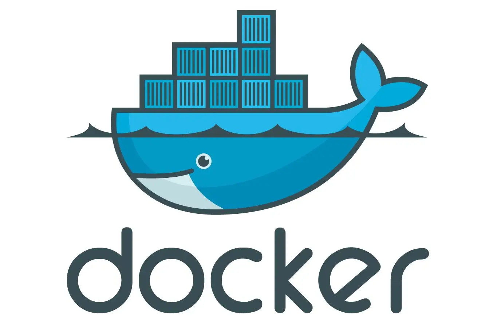
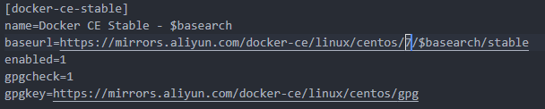

# Docker



Docker 是一个开源的应用容器引擎，让开发者可以打包他们的应用以及依赖包到一个可移植的镜像中，然后发布到任何流行的 Linux 或 Windows 机器上

## Docker 与虚拟机的区别

- Docker 是一个容器，它基于 Linux 内核实现

- Docker 体积更小:容器运行的是不完整的操作系统（尽管它们可以），虚拟机必须运行完整的操作系统

- Docker 启动速度更快:虚拟机启动需要数分钟，而 Docker 容器可以在数毫秒内启动

### 用途/作用

虚拟机更擅长于彻底隔离整个运行环境,虚拟机更擅长于彻底隔离整个运行环境。例如，云服务提供商通常采用虚拟机技术隔离不同的用户。Docker 通常用于隔离不同的应用，例如前端，后端以及数据库。

## 安装和配置 Docker

在开始安装之前，需要安装 `device-mapper-persistent-data` 和 `lvm2` 两个依赖。

- `device-mapper-persistent-data` 是 Linux 下的一个存储驱动， Linux 上的高级存储技术。

- `lvm` 的作用则是创建逻辑磁盘分区。

```shell
yum install -y yum-utils device-mapper-persistent-data lvm2
```

依赖安装完毕后，我们将阿里云的 Docker 镜像源添加进去。可以加速 Docker 的安装。

```shell
sudo yum-config-manager --add-repo http://mirrors.aliyun.com/docker-ce/linux/centos/docker-ce.repo

yum install docker-ce -y
```

安装 Docker 时可能出现如下的报错信息：

> Errors during downloading metadata for repository 'docker-ce-stable':
> Status code: 404 for <https://mirrors.aliyun.com/docker-ce/linux/centos/3/x86_64/stable/repodata/repomd.xml> (IP: 39.96.118.196)
> Error: Failed to download metadata for repo 'docker-ce-stable': Cannot download repomd.xml: Cannot download repodata/repomd.xml: All mirrors were tried

此时我们需要对 `docker-ce.repo` 进行部分修改，即将 `$releasever` 变量全部替换为 `7`。



## 启动 Docker 服务

```shell
sudo systemctl enable docker // 设置开机自启
sudo systemctl start docker //  启动docker
```

## Docker 内配置 Nginx

```shell
docker container run -d -p 4030:80 --rm --name mynginx nginx
```

上面命令的各个参数含义如下:

- -d：在后台运行
- -p ：容器的 80 端口映射到 127.0.0.1:4030
- --rm：容器停止运行后，自动删除容器文件
- --name：容器的名字为 mynginx
- 末尾的 nginx：表示根据 nginx 镜像运行容器。

要修改 Nginx 的配置文件，首先需要进入 Nginx 容器里面，使用下面的命令进入容器里面

```shell
docker exec -it nginx /bin/bash
```

上面命令的解释说明：

- -it：表示分配一个伪终端。
- nginx：表示容器的名称，这里也可以使用容器 ID。
- /bin/bash：表示对容器执行 bash 操作。

然后，把这个容器终止，由于--rm 参数的作用，容器文件会自动删除。

```shell
docker container stop mynginx
```
