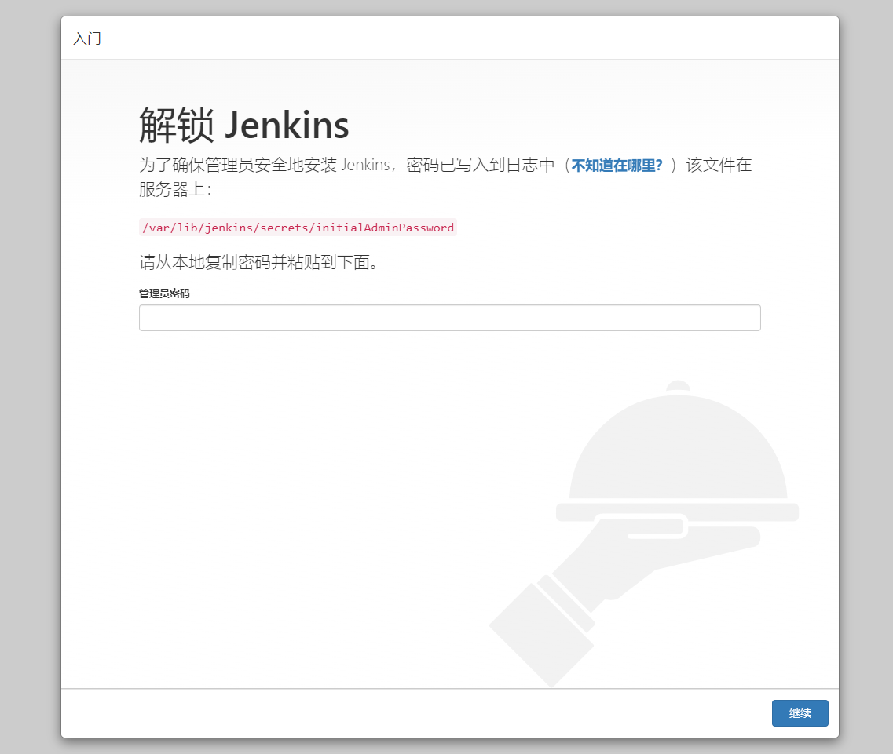
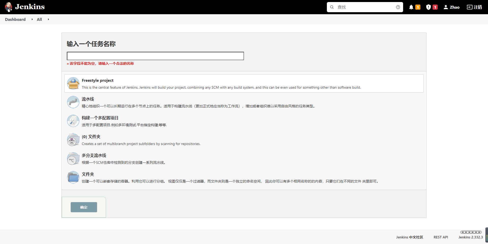
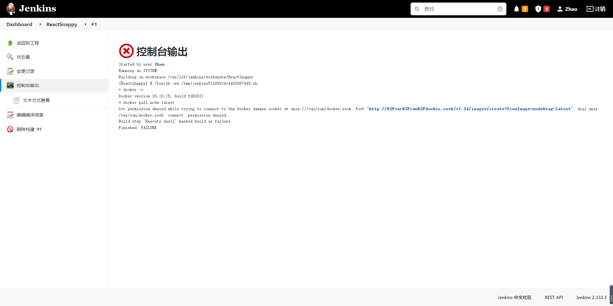
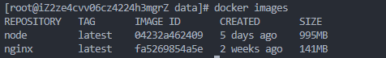

# Jenkins


Jenkins 是一个基于 Java 语言开发的持续构建工具平台，主要用于持续、自动的构建/测试你的软件和项目。它可以执行你预先设定好的设置和构建脚本，也可以和 Git 代码库做集成，实现自动触发和定时触发构建。

## 安装 OpenJDK

因为 Jenkins 是 Java 编写的持续构建平台，因此需要安装 Java。在这里，我们选择安装开源的 `openjdk` 。在这我们直接使用 `yum` 包管理器安装 openjdk 即可。

```shell
yum install -y java
```

## 安装 Jenkins

下载 Jenkins 到 `/data` 目录，此处使用清华镜像源，建议替换为可使用的版本：

```shell
cd /data
wget https://mirrors.tuna.tsinghua.edu.cn/jenkins/redhat-stable/jenkins-2.332.3-1.1.noarch.rpm
sudo yum install jenkins-2.332.3-1.1.noarch.rpm
```

## 启动 Jenkins

Jenkins 安装后，会将启动命令注册到系统 Service 命令中。所以我们直接使用系统 service 命令启动 Jenkins 即可。

在这里，有三个命令可以使用，分别对应启动、重启、停止 三个命令。

```shell
service jenkins start
# service jenkins restart restart 重启 Jenkins
# service jenkins restart stop 停止 Jenkins
```

## 初始化 Jenkins 配置

Jenkins 服务启动后将部署到 8080 端口，可以通过浏览器进行服务访问。

### 解锁 Jenkins

在 Jenkins 启动完成后，会自动跳转至这个界面。这是 Jenkins 的解锁界面，你需要输入存放在服务器的初始解锁密码才能进行下一步操作。

Jenkins 启动后，会生成一个初始密码。该密码在服务器的文件内存放，我们可以进入服务器查看密码内容，将密码填写在 Jenkins 的管理员密码输入框内：



输入密码并且点击“继续”按钮后即可解锁 Jenkins。

### 下载插件

解锁后就来到了插件下载页面，这一步要下载一些 Jenkins 的功能插件。


因为 Jenkins 插件服务器在国外，所以速度不太理想。我们需要更换为清华大学的 Jenkins 插件源后，再安装插件，所以先不要点安装插件。

更换方法很简单。进入服务器，将 `/var/lib/jenkins/updates/default.json` 内的插件源地址替换成清华大学的源地址，将 google 替换为 baidu 即可。

```shell
sed -i 's/http:\/\/updates.jenkins-ci.org\/download/https:\/\/mirrors.tuna.tsinghua.edu.cn\/jenkins/g' /var/lib/jenkins/updates/default.json && sed -i 's/http:\/\/www.google.com/https:\/\/www.baidu.com/g' /var/lib/jenkins/updates/default.json
```

接着点击“安装推荐的插件”即可，稍等一会插件安装完毕。

### 完成安装

插件安装完毕后，接着是注册管理员账号。


注册结束后看见该页面说明已经安装完成。


### 测试安装

到这里，我们的 Jenkins 算是启动成功了。但是，我们还需要对 Jenkins 做一点点简单的配置，才可以让它可以构建 docker 镜像。

我们可以在首页点击左侧导航栏的新建 Item，输入任务名并选择 `Freestyle project` 以创建一个任务。



新建完毕后，找到“构建”一项，选择“增加构建步骤”，选择“执行 shell”，输入以下命令:

```shell
docker -v
docker pull node:latest
```

该命令会去拉取一个 nodejs 稳定版的镜像，我们可以来测试 Docker 的可用性。


保存后，我们点击“立即构建”后，Jenkins 就会开始构建。


选择左侧历史记录第一项（最新的一项），点击控制台输出，查看构建日志,执行后，我们发现提示无访问权限。这是由于在 Linux 中， `Unix socket` 属于 root 用户，因此需要 root 权限才能访问。



在 docker 中， docker 提供了一个用户组的概念。我们可以将执行 Shell 的用户添加到名称为 docker 的用户组，则可以正常执行 docker 命令。而在 Jenkins 中执行的终端用户做 jenkins ，所以我们只需要将 jenkins 加入到 docker 用户组即可。

```shell
sudo groupadd docker          #新增docker用户组
sudo gpasswd -a jenkins docker  #将当前用户添加至docker用户组
newgrp docker                 #更新docker用户组
```

加入后重启`Jenkins`：

```shell
sudo service jenkins restart
```

重启`Jenkins`后再次执行脚本，此时执行成功：


### docker 配置

此时我们查看 docker 的镜像 `docker images` 时可以发现增加了 docker 的 node 镜像，这是我们通过 Jenkins 自动安装的：



进入此 docker 镜像：

```shell
docker run -it node /bin/bash
```

进入 docker 镜像后对其进行一定的配置

```shell
# 配置淘宝镜像源
npm config set registry https://registry.npm.taobao.org

npm get registry
# 可能提示已安装，就不用再安装了
npm install yarn -g

yarn config set registry http://registry.npm.taobao.org/

yarn config get registry
# 退出docker镜像
exit
```
