# Jenkins


Jenkins 是一个基于 Java 语言开发的持续构建工具平台，主要用于持续、自动的构建/测试你的软件和项目。它可以执行你预先设定好的设置和构建脚本，也可以和 Git 代码库做集成，实现自动触发和定时触发构建。

## 安装 OpenJDK

因为 Jenkins 是 Java 编写的持续构建平台，因此需要安装 Java。在这里，我们选择安装开源的 `openjdk` 。在这我们直接使用 `yum` 包管理器安装 openjdk 即可。

```shell
yum install -y java
```

## 安装 Jenkins

下载 Jenkins 到 `/data` 目录，此处使用清华镜像源，建议替换为可使用的版本：

```shell
cd /data
wget https://mirrors.tuna.tsinghua.edu.cn/jenkins/redhat-stable/jenkins-2.332.3-1.1.noarch.rpm
sudo yum install jenkins-2.332.3-1.1.noarch.rpm
```

## 启动 Jenkins

Jenkins 安装后，会将启动命令注册到系统 Service 命令中。所以我们直接使用系统 service 命令启动 Jenkins 即可。

在这里，有三个命令可以使用，分别对应启动、重启、停止 三个命令。

```shell
service jenkins start
# service jenkins restart restart 重启 Jenkins
# service jenkins restart stop 停止 Jenkins
```

## 初始化 Jenkins 配置

Jenkins 服务启动后将部署到 8080 端口，可以通过浏览器进行服务访问。

### 解锁 Jenkins

在 Jenkins 启动完成后，会自动跳转至这个界面。这是 Jenkins 的解锁界面，你需要输入存放在服务器的初始解锁密码才能进行下一步操作。

Jenkins 启动后，会生成一个初始密码。该密码在服务器的文件内存放，我们可以进入服务器查看密码内容，将密码填写在 Jenkins 的管理员密码输入框内：

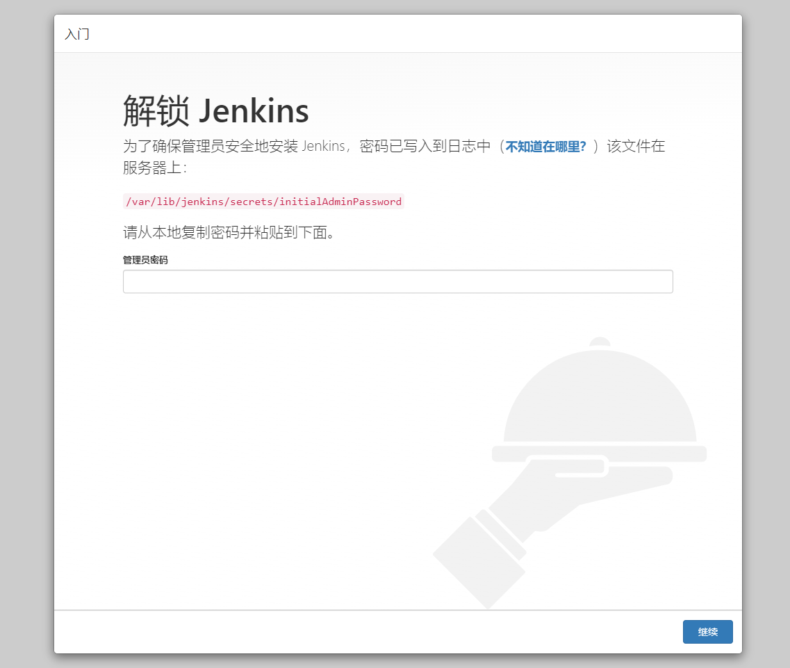

输入密码并且点击“继续”按钮后即可解锁 Jenkins。

### 下载插件

解锁后就来到了插件下载页面，这一步要下载一些 Jenkins 的功能插件。

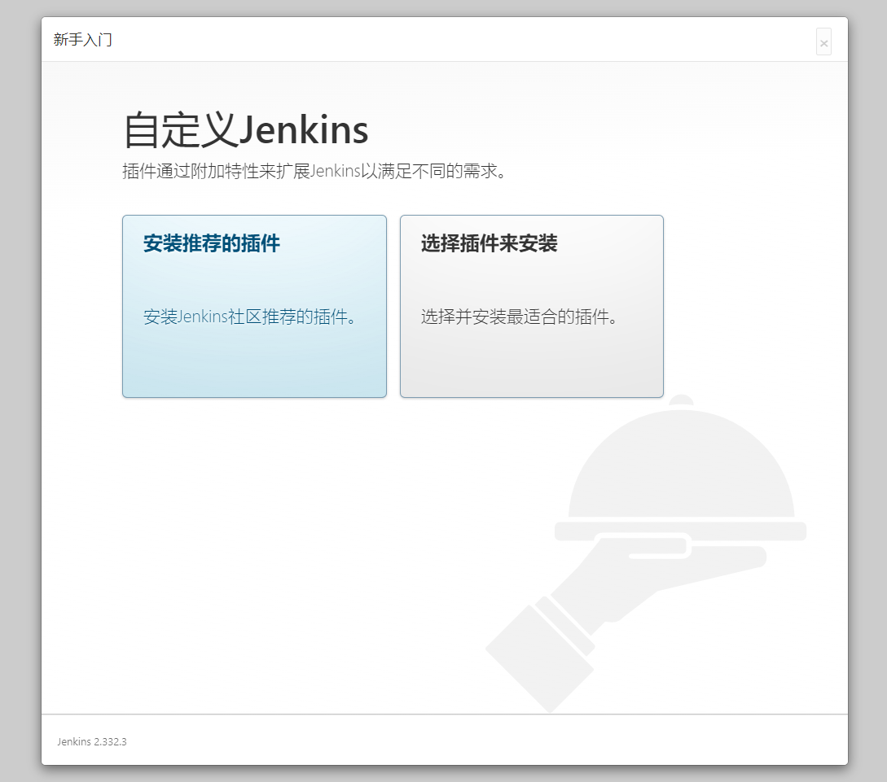

因为 Jenkins 插件服务器在国外，所以速度不太理想。我们需要更换为清华大学的 Jenkins 插件源后，再安装插件，所以先不要点安装插件。

更换方法很简单。进入服务器，将 `/var/lib/jenkins/updates/default.json` 内的插件源地址替换成清华大学的源地址，将 google 替换为 baidu 即可。

```shell
sed -i 's/http:\/\/updates.jenkins-ci.org\/download/https:\/\/mirrors.tuna.tsinghua.edu.cn\/jenkins/g' /var/lib/jenkins/updates/default.json && sed -i 's/http:\/\/www.google.com/https:\/\/www.baidu.com/g' /var/lib/jenkins/updates/default.json
```

接着点击“安装推荐的插件”即可，稍等一会插件安装完毕。

### 完成安装

插件安装完毕后，接着是注册管理员账号。

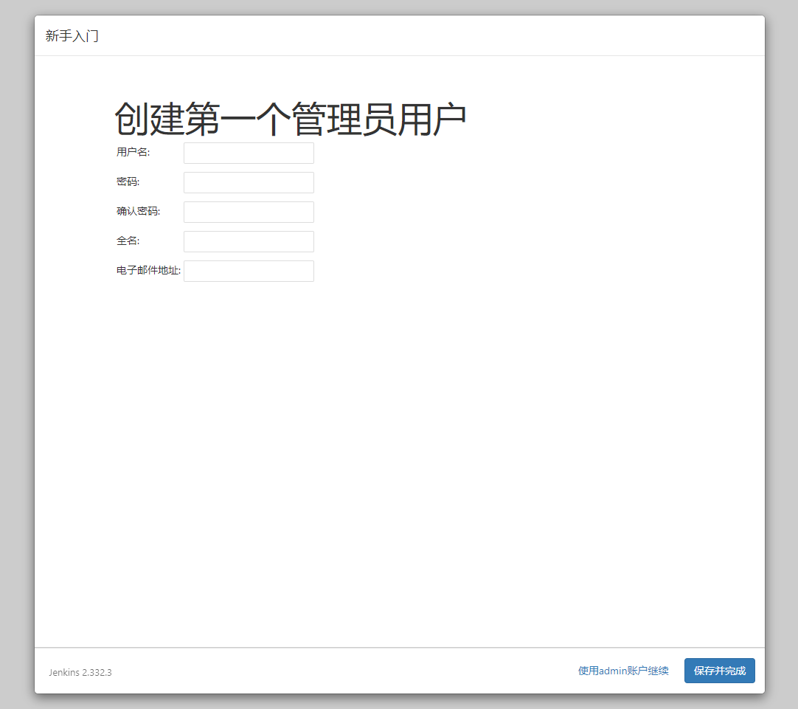

注册结束后看见该页面说明已经安装完成。

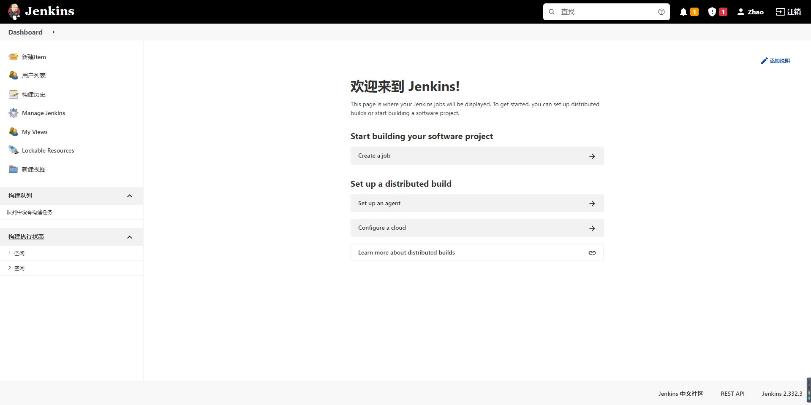

### 测试安装

到这里，我们的 Jenkins 算是启动成功了。但是，我们还需要对 Jenkins 做一点点简单的配置，才可以让它可以构建 docker 镜像。

我们可以在首页点击左侧导航栏的新建 Item，输入任务名并选择 `Freestyle project` 以创建一个任务。

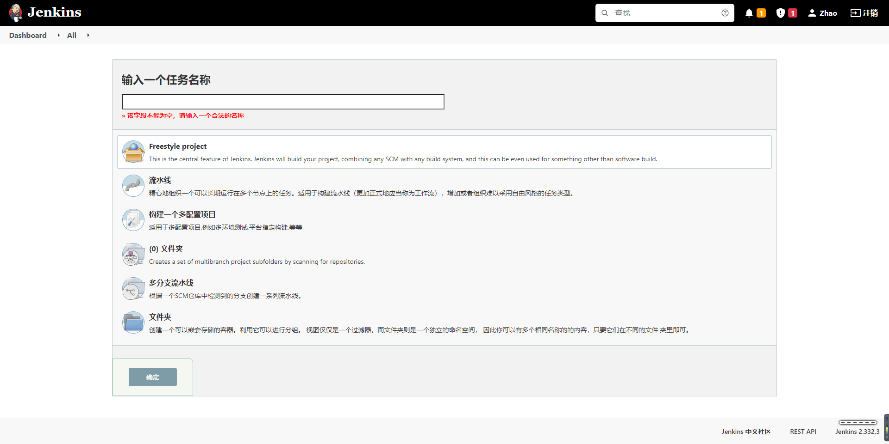

新建完毕后，找到“构建”一项，选择“增加构建步骤”，选择“执行 shell”，输入以下命令:

```shell
docker -v
docker pull node:latest
```

该命令会去拉取一个 nodejs 稳定版的镜像，我们可以来测试 Docker 的可用性。

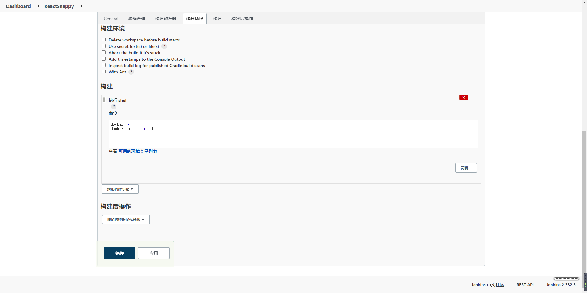

保存后，我们点击“立即构建”后，Jenkins 就会开始构建。

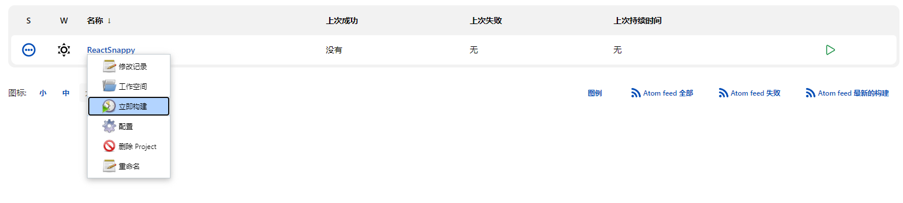

选择左侧历史记录第一项（最新的一项），点击控制台输出，查看构建日志,执行后，我们发现提示无访问权限。这是由于在 Linux 中， `Unix socket` 属于 root 用户，因此需要 root 权限才能访问。

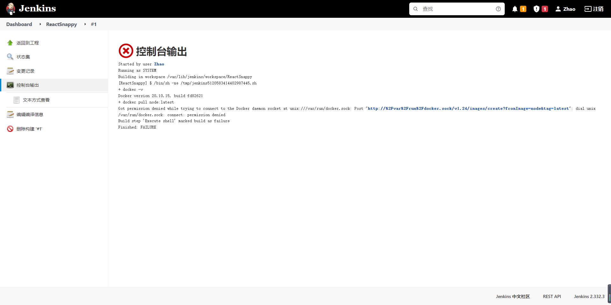

在 docker 中， docker 提供了一个用户组的概念。我们可以将执行 Shell 的用户添加到名称为 docker 的用户组，则可以正常执行 docker 命令。而在 Jenkins 中执行的终端用户做 jenkins ，所以我们只需要将 jenkins 加入到 docker 用户组即可。

```shell
sudo groupadd docker          #新增docker用户组
sudo gpasswd -a jenkins docker  #将当前用户添加至docker用户组
newgrp docker                 #更新docker用户组
```

加入后重启`Jenkins`：

```shell
sudo service jenkins restart
```

重启`Jenkins`后再次执行脚本，此时执行成功：

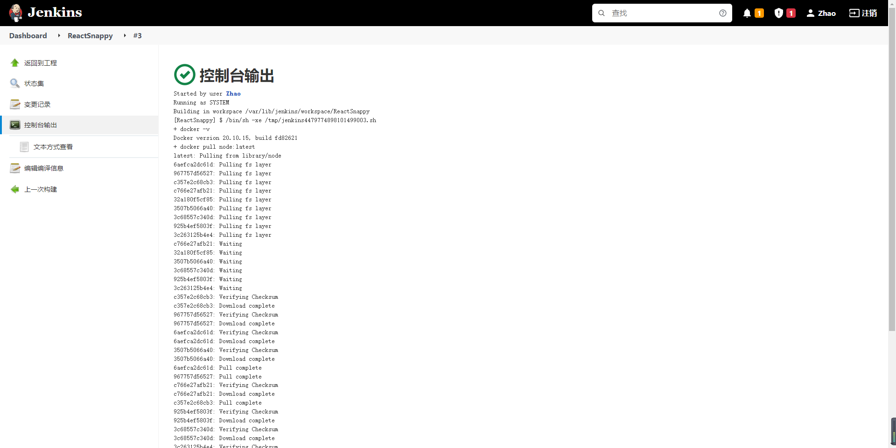

### docker 配置

此时我们查看 docker 的镜像 `docker images` 时可以发现增加了 docker 的 node 镜像，这是我们通过 Jenkins 自动安装的：

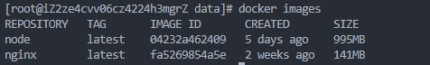

进入此 docker 镜像：

```shell
docker run -it node /bin/bash
```

进入 docker 镜像后对其进行一定的配置

```shell
# 配置淘宝镜像源
npm config set registry https://registry.npm.taobao.org

npm get registry
# 可能提示已安装，就不用再安装了
npm install yarn -g

yarn config set registry http://registry.npm.taobao.org/

yarn config get registry
# 退出docker镜像
exit
```

## 使用 SSH 协议集成 Git 仓库源

在这步中，我们将使用 Jenkins 集成外部 Git 仓库，实现对真实代码的拉取和构建。

### 服务器安装 git

使用 `yum -y install git` 指令安装 git，安装后使用 `git --verison` 查看是否安装成功。

### 生成公钥私钥

首先，我们先来配置公钥和私钥。这是 Jenkins 访问 Git 私有库的常用认证方式。我们可以使用 `ssh-keygen` 命令即可生成公钥私钥。

```shell
ssh-keygen -t rsa -C "269629082@qq.com"
```

执行后，会遇到第一步骤：`Enter file in which to save the key` 。这一步是询问你要将公钥私钥文件放在哪里。默认是放在 `~/.ssh/id_rsa 下`，当然也可以选择输入你自己的路径。结束后，你会得到两个文件。分别是 `id_rsa` 和 `id_rsa.pub`。其中，`id_rsa` 是私钥文件，`id_rsa.pub` 是对应的公钥文件。我们需要在 Git 端配置公钥，在 Jenkins 端使用私钥与 Git 进行身份校验。

### 在 Gitee 中配置公钥

在 Gitee 中添加 SSH 公钥，其中的公钥为刚才生成的 `id_rsa.pub` 文件，可以使用 `cat ~/.ssh/id_rsa.pub` 进行查看。

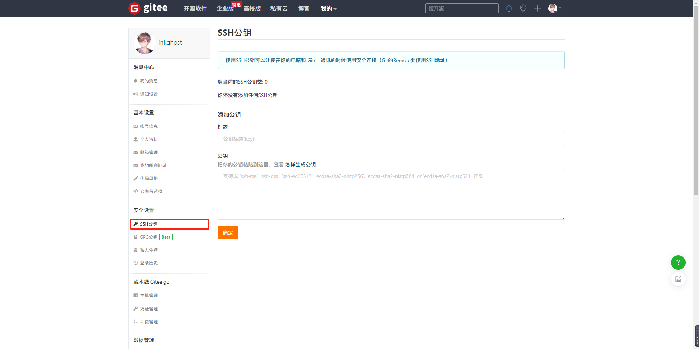

### 在 Jenkins 配置私钥

在 Jenkins 中，私钥/密码等认证信息都是以“凭证”的方式管理的，所以可以做到全局都通用。我们可以在配置任务时，来添加一个自己的“凭证”。点击项目的“配置”，依次找到 “源码管理” => “Git” => “Repositories”。

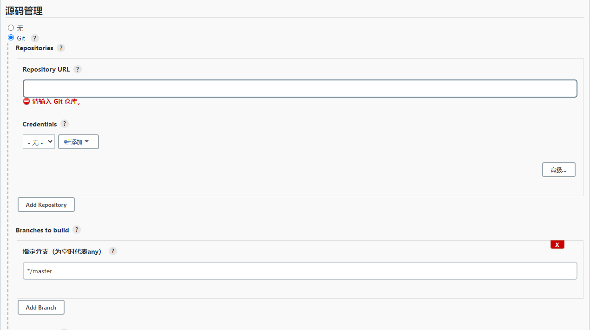

`Repository URL` 则是我们的仓库地址， SSH 地址格式为 `git@gitee.com:xxx/xxx.git`。

`Credentials` 是我们选择认证凭证的地方。我们可以点击右侧 “添加” => “Jenkins” 按钮添加一条新的凭证认证信息。点击后会打开一个弹窗，这是 Jenkins 添加凭证的弹窗。选择类型中的 `SSH Username with private key` 这一项。接着填写信息即可：

`ID`：这条认证凭证在 Jenkins 中的名称是什么
`描述`：描述信息
`Username`：用户名（邮箱）
`Private Key`：这里则是我们填写私钥的地方

在命令行窗口，查看私钥文件内容，并复制它 `cat ~/.ssh/id_rsa`。点击 Add 按钮，将私钥文件内所有文件内容全部复制过去（包含开头的 BEGIN OPENSSH PRIVATE KEY 和结尾的 END OPENSSH PRIVATE KEY）接着点击添加按钮，保存凭证。

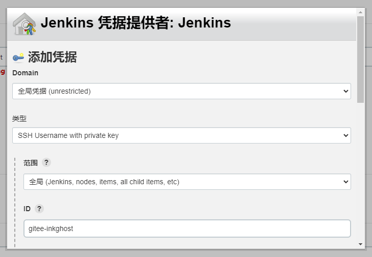

选择凭证后若无其他提示则说明身份校验成功。

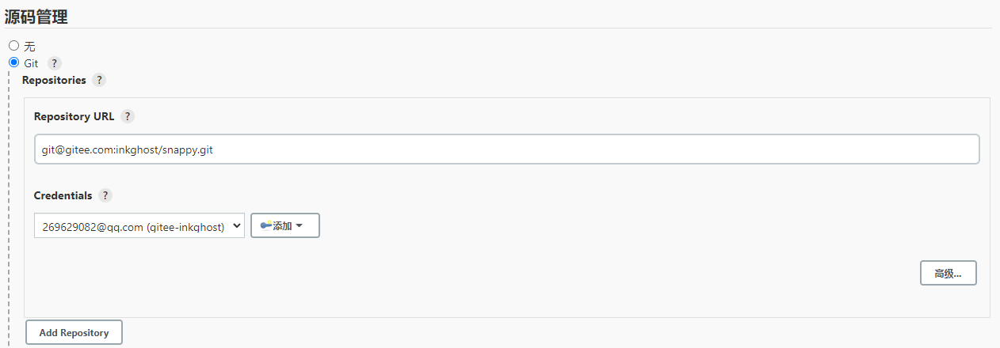

## 构建镜像

在我们将环境准备就绪后，就可以开始构建镜像了。不过在此之前我们需要先准备个 DockerFile 。

### 编写 Dockerfile

Dockerfile 是一个 Docker 镜像的基础描述文件，里面描述了生成一个镜像所需要的执行步骤。我们也可以自定义一份 Dockerfile 来创建一个自己的镜像。

例如下面的步骤，使用 Dockerfile 可描述为：

1. 基于 nginx:1.15 镜像做底座。
2. 拷贝相对路径 build 文件夹内的文件，到镜像内 /etc/nginx/html 文件夹。
3. 拷贝相对路径下 default.conf 文件，到镜像内 /etc/nginx/conf.d 文件夹。
4. 设置工作目录为镜像内的 /etc/nginx/html

```shell
FROM nginx:1.15-alpine
COPY build /etc/nginx/html
COPY default.conf /etc/nginx/conf.d
WORKDIR /etc/nginx
```

编写完成后我们只需要使用 `docker build` 命令就可以构建一个镜像了：

```shell
docker build -t imagename:version .
```

标签格式为 `镜像名:版本 .` ：声明要寻找 dockerfile 文件的路径。 `.` 代表当前路径下寻找，默认文件名为 Dockerfile。我们只需要在自己的代码中添加相关文件并提交至代码库中即可。

## Jenkins 端配置

为便于代码更新，我们需要在服务器先 `clone` 代码源。

在代码源和 `DockerFile` 准备就绪后。在服务器的 `/data/jenkins` 目录下新建一个 `snappy-react.sh` 脚本文件。

```shell
touch snappy-react.sh
```

并且修改脚本文件为我们所需要的内容(Jenkins 会自动更新仓库)：

```shell
#!/bin/sh -l

cd ./public
yarn
yarn build
docker build -t snappy-react .
docker stop snappy-react
docker rm snappy-react
docker run --name=snappy-react -d -p 3000:80 snappy-react
```

最后只需在 Jenkins 端配置下要执行的 Shell 脚本即可。找到项目的配置，依次找到“构建” => “Execute shell”。输入以下脚本：

```shell
sh /data/jenkins/snappy-react.sh
```

## 自动执行任务

### 安装插件

安装 `Generic Webhook Trigger Plugin` 插件（系统管理-插件管理-可用插件-搜索 `Generic Webhook`）。

### 添加触发器

`Generic Webhook Trigger Plugin` 插件功能很强大，可以根据不同的触发参数触发不同的构建操作。

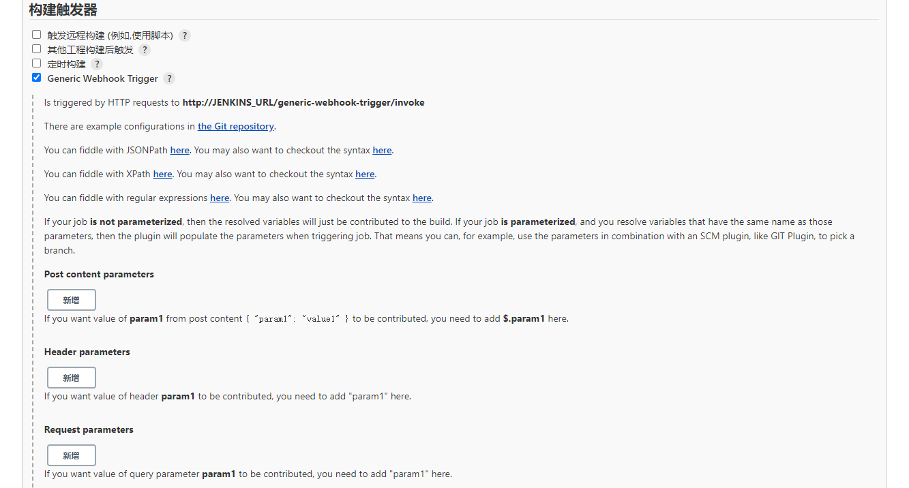

### Git 仓库配置钩子

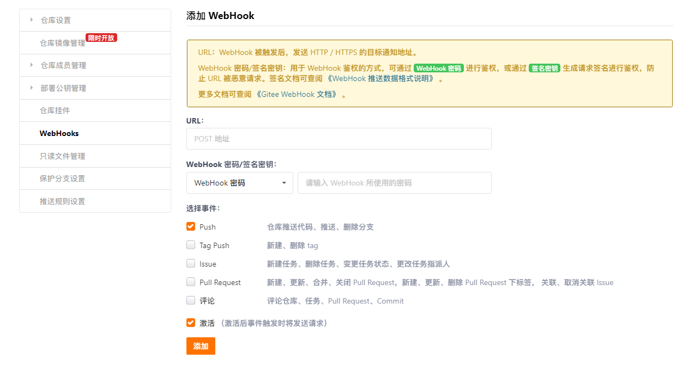

上图中的 URL 格式为 `http://<User ID>:<API Token>@<Jenkins IP 地址>:端口/generic-webhook-trigger/invoke`

- 获取 `User ID`

Jenkins 左侧栏点击“系统管理”=>“管理用户”以查看。

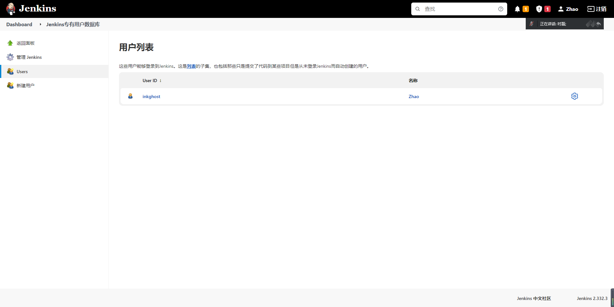

- 获取 `API Token`

接下来点击工具图标，进入详情界面后找到 API Token 以生成 Token。

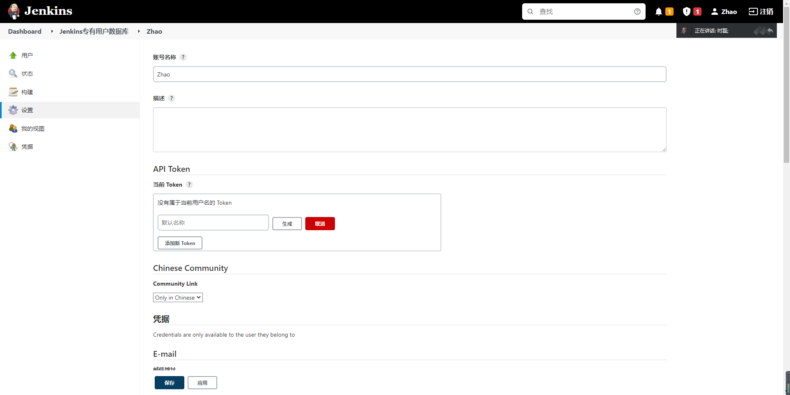

- WebHook 密码

即 Jenkins 登录密码。

点击提交即可完成配置，我们可以点击“测试”按钮以测试钩子是否生效。
